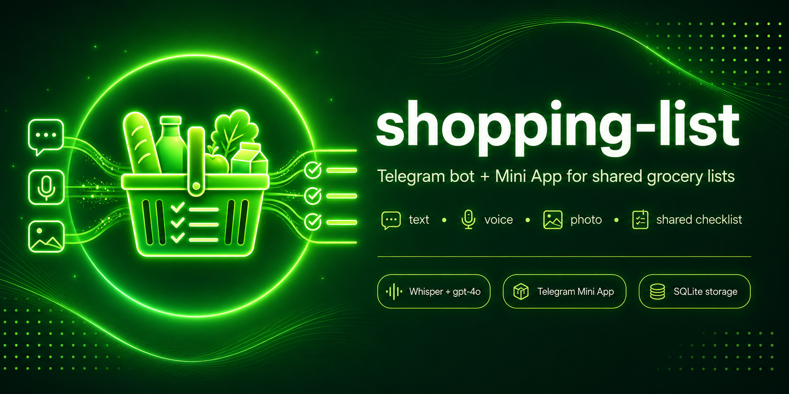

# shopping-list

<p align="center">
  
</p>

<p align="center">
  
  
</p>

Telegram-бот + Mini App для общего списка покупок. Принимает текст, голосовые сообщения и фото — раскладывает в список с группировкой по категориям через OpenAI (Whisper + gpt-4o). Список один и общий для всех whitelisted-пользователей; когда все товары отмечены купленными — уходит в архив, и можно создать новый.

## Что умеет

- 📝 **Текст** — «молоко 1 л, хлеб, яйца 10 шт, фольга, батарейки 4, изолента» → 6 позиций в списке. Парсер распознаёт практически любые товары для дома и семьи: продукты, бытовую химию и расходники (фольга, пергамент, салфетки), гигиену и косметику, бытовую технику и электронику, строительные и ремонтные товары, корм для животных, детские товары, канцелярию и др. Если пользователь ввёл только число без единицы («молоко 1», «яблоки 5», «батарейки 4»), парсер сам подберёт единицу по контексту товара (`1 л`, `5 шт`, `4 шт`, `500 г`, …).
- ✨ **Авто-форматирование имён** — все названия товаров сохраняются строчными буквами, а токены брендов и торговых марок (`Coca-Cola`, `iPhone`, `Простоквашино`, `Nestlé`, `Lay's`, …) сохраняют свою каноническую капитализацию. Бренды выделяет LLM, финальную форму гарантирует детерминированный пост-процессор — поэтому «Молоко Простоквашино», «молоко простоквашино» и «МОЛОКО ПРОСТОКВАШИНО» дают одно и то же значение в БД: `молоко Простоквашино`.
- 🎙 **Голосовое** — `gpt-4o-mini-transcribe` (более точный, чем `whisper-1`) транскрибирует, парсер выделяет товары. Биас-словарь `WHISPER_PROMPT` подсказывает редкие слова (семена чиа, киноа, фольга, изолента и т.п.), чтобы они не путались с похожими по звучанию.
- 📷 **Фото** — gpt-4o (vision) распознаёт чек, продукты в холодильнике/на полке, рукописные записки.
- 📲 **Mini App** — один активный список, прогресс-бар, чекбоксы, primary-CTA «Добавить товары» в футере. Свайп влево по строке открывает «Изменить» / «Удалить», bottom-sheet правит название, количество и категорию. Отмеченные товары автоматически уезжают в конец своей категории, неотмеченные остаются сверху; только что отмеченный встаёт последним. Когда все товары отмечены — список автоматически уезжает в архив. На мобилках открывается в fullscreen и не сворачивается случайным вертикальным свайпом. Закрытие — через нативные контролы Telegram.
- 🗂 **Категории** — каждый товар при разборе получает одну из трёх категорий: **Продукты** (`food`), **Бытовые товары** (`home`), **Косметика и гигиена** (`care`). Категорию проставляет LLM на этапе парсинга, а вручную её можно сменить в шторке «Изменить товар» (если разбор ошибся). В Mini App список и архивные карточки сгруппированы по категориям с заголовками (`done/total` у активного списка); пустые группы скрыты, внутри группы купленные уезжают вниз. Товары без категории (старые записи) показываются в «Продукты». Бэкфилл существующих — `scripts/backfill_categories.py`.
- 🧹 **«Убрать купленное»** — кнопка в прогресс-баре активного списка. Появляется, когда часть товаров куплена, а часть ещё нет. Купленные переезжают в новый архивный список, активный остаётся только с непокупленными. История покупок сохраняется в архиве.
- 🗂 **Архив** — список архивных карточек с датой+временем создания. Внутри карточки: «Добавить в текущий список» / «Создать новый список» (всё снимается с галочки) или «Удалить список» с подтверждением.
- ⏳ **Status banner** — пока бот разбирает текст / голосовое / фото из чата, в Mini App над футером висит индикатор стадии («Распознаю…», «Извлекаю товары…», «Добавлено N товаров»).
- 👥 **Whitelist** — `ALLOWED_USER_IDS` ограничивает, кто может писать боту и открывать Mini App.
- 💬 **Группа + личка** — бот работает в одном групповом чате (`TARGET_CHAT_ID`) и в DM whitelisted-юзеров. Список общий.
- 🔔 **Статус в чате** — на каждое входящее сообщение бот шлёт промежуточный статус («📝 Разбираю…», «📷 Распознаю фото…», «🎙 Слушаю…») и заменяет его финалом «✓ Добавил N товаров». В групповом чате ответы привязаны reply'ем к исходному сообщению.
- 🔔 **Уведомления другим участникам** — когда кто-то добавил товары, остальные узнают об этом. Добавление в группе → ЛС каждому участнику whitelist, кроме автора. Добавление в ЛС с ботом → пост в группу с `@username`-тегами участников кроме автора (в forum-группе — в запиненный топик) плюс дублирующее ЛС каждому, кроме автора. В уведомлении — имя автора, список добавленных товаров и кнопка «🛒 Список». Username для тега берётся live из Telegram (`get_chat_member`); у кого нет публичного username — тег не ставится (Telegram не даёт реального тега без него), но ЛС всё равно приходит. ЛС доходят только тем, кто стартовал бота приватно.
- 🛒 **Mini App из группы** — кнопка «🛒 Список» работает и в DM (через `WebAppInfo`), и в группе (через direct-link `t.me/<bot>/<short_name>`, см. `WEBAPP_SHORT_NAME`). При добавлении бота в группу он автоматически шлёт приветственное сообщение с кнопкой и пинит его. Если автопин не сработал — `/pin` в группе делает то же руками.

**Команды бота:**

- `/start`, `/help` — приветствие, список фич, как пользоваться
- `/new` — закрыть текущий список (в архив) и начать новый
- `/pin` — переслать в группу приветственный пост Mini App и запинить (нужно `can_pin_messages`)

## Стек

- Python 3.11 (bot) / 3.12 (webapp)
- [aiogram 3.15](https://github.com/aiogram/aiogram) — Telegram Bot API
- [FastAPI](https://fastapi.tiangolo.com/) + [uvicorn](https://www.uvicorn.org/) — webapp
- [OpenAI SDK](https://github.com/openai/openai-python) — Whisper, gpt-4o, gpt-4o-mini
- [aiosqlite](https://github.com/omnilib/aiosqlite) — SQLite-хранилище
- [pydantic-settings](https://docs.pydantic.dev/latest/concepts/pydantic_settings/) — конфиг из `.env`
- [FFmpeg](https://ffmpeg.org/) (системная зависимость) — нормализация голосовых в MP3 16kHz mono
- [React 19](https://react.dev/) + [Vite 6](https://vite.dev/) + [TypeScript 5](https://www.typescriptlang.org/) — Mini App SPA (исходники в `webapp/frontend/`, билд `vite build` пишет в `webapp/static/`)
- [Node.js 22 LTS](https://nodejs.org/) — сборка фронта (только build-time, рантайм webapp остаётся на Python)

## Структура проекта

```
shopping-list/
├── bot/
│   ├── main.py                 # entry, Dispatcher, set_chat_menu_button
│   ├── config.py               # pydantic Settings
│   ├── handlers/
│   │   ├── _common.py          # клавиатура Mini App + format_added/plural_ru/success_status
│   │   ├── commands.py         # /start /help /new /pin
│   │   ├── text.py             # F.text — парсер списка
│   │   ├── voice.py            # F.voice — Whisper → парсер
│   │   ├── photo.py            # F.photo — gpt-4o vision
│   │   └── membership.py       # my_chat_member — приветствие+пин при добавлении в группу
│   ├── middlewares/auth.py     # whitelist + chat filter + topic filter (pinned_thread_id)
│   ├── services/
│   │   ├── openai_client.py    # singleton AsyncOpenAI
│   │   ├── notify.py           # рассылка уведомлений о добавлении (ЛС + пост в группу)
│   │   ├── parser.py           # text → list[ParsedItem] (с распознаванием брендов)
│   │   ├── name_format.py      # lowercase + canonical brand capitalization
│   │   ├── transcriber.py      # voice → text via Whisper
│   │   ├── vision.py           # image → list[ParsedItem] via gpt-4o
│   │   ├── ffmpeg_runner.py    # async subprocess
│   │   ├── media.py            # .ogg → .mp3 16k mono
│   │   ├── shopping.py         # бизнес-логика (списки, items, архив, reuse)
│   │   ├── ingest_state.py     # прогресс ингеста для Mini App status banner
│   │   └── temp_cleanup.py     # периодическая чистка TEMP_DIR
│   └── db/
│       ├── schema.sql          # lists, items (+ category), ingest_events, app_settings
│       ├── store.py            # connect, init_db (+ guarded ALTER миграции)
│       ├── settings_kv.py      # key/value стор (pinned_thread_id и т.п.)
│       └── models.py
├── webapp/
│   ├── main.py                 # FastAPI app + lifespan
│   ├── auth.py                 # initData HMAC verification
│   ├── api.py                  # /api/state /api/archive[/{id}[/reuse]] /api/items/{id}[/state] /api/lists/new /api/lists/{id}/archive-purchased
│   ├── frontend/               # Mini App SPA (Vite + React 19 + TS 5)
│   │   ├── package.json
│   │   ├── vite.config.ts
│   │   ├── tsconfig.json
│   │   ├── eslint.config.js
│   │   ├── index.html          # Vite entry-точка
│   │   └── src/
│   │       ├── main.tsx        # createRoot, init темы, lockMiniApp
│   │       ├── App.tsx         # корневой компонент (polling /api/state, view-роутинг)
│   │       ├── theme.ts        # LIGHT/DARK токены + useTheme (useSyncExternalStore)
│   │       ├── types.ts        # типы API
│   │       ├── icons.tsx       # SVG-иконки (Plus, Mic, Camera, Check, Cart, Archive, ...)
│   │       ├── lib/            # telegram.ts, constants.ts, format.ts, primary.ts, categories.ts
│   │       ├── api/client.ts   # fetch-обёртка с X-Telegram-Init-Data
│   │       ├── components/     # GroupedList, ItemRow, EditSheet, ConfirmSheet, Progress, StatusBanner, ChatHint, StarterScreen, EmptyState, ArchiveScreen, ArchiveDetailScreen
│   │       └── styles/globals.css  # анимации, safe-area, скрытие скроллбара
│   └── static/                 # gitignored: артефакт `vite build` (index.html + assets/*)
├── tests/
│   ├── conftest.py             # фикстуры + sign_init_data
│   ├── test_auth.py
│   ├── test_keyboard.py
│   ├── test_name_format.py
│   ├── test_parser.py
│   ├── test_shopping.py
│   ├── test_ingest_state.py
│   ├── test_webapp_auth.py
│   └── test_webapp_api.py
├── scripts/
│   ├── normalize_existing_items.py   # одноразовая миграция имён под новый формат
│   └── backfill_categories.py        # одноразовый бэкфилл category существующим товарам (LLM)
├── assets/
│   └── cover.png               # обложка README
├── data/                       # gitignored: shopping.db
├── Dockerfile.bot
├── Dockerfile.webapp
├── docker-compose.yml
├── requirements.txt
├── requirements-webapp.txt
├── requirements-dev.txt
├── pytest.ini
├── .env.example
├── VERSION
├── CHANGELOG.md
├── LICENSE
└── README.md
```

## .env

```env
BOT_TOKEN=                                 # токен бота от @BotFather
OPENAI_API_KEY=                            # ключ OpenAI
ALLOWED_USER_IDS=                          # CSV: 12345,67890
TARGET_CHAT_ID=                            # id группового чата (опционально)
WEBAPP_URL=https://your-mini-app.example.com
WEBAPP_SHORT_NAME=                         # short-name Mini App из BotFather (нужен для группового чата)
DB_PATH=data/shopping.db
TEMP_DIR=/tmp/shopping-list
LOG_LEVEL=INFO
```

`TARGET_CHAT_ID` — id группового чата (целое со знаком `-`, например `-1001234567890`). Бот игнорирует сообщения из любых других групповых чатов. Если не задан — бот отвечает только на DM whitelisted-юзеров.

**Опциональные** (можно не задавать — дефолты захардкожены в `bot/config.py`):

```env
PARSER_MODEL=gpt-4o-mini                   # модель для парсинга текста в позиции списка
VISION_MODEL=gpt-4o                        # модель vision для фото
WHISPER_MODEL=gpt-4o-mini-transcribe       # модель транскрибации голосового; альтернативы: gpt-4o-transcribe (точнее, дороже), whisper-1 (legacy)
WHISPER_LANGUAGE=ru                        # ISO-код языка для Whisper; пусто = автодетект
WHISPER_PROMPT=                            # биас-словарь (~244 токена) для STT: добавь сюда редкие слова из своих обычных списков (бренды, ингредиенты), чтобы Whisper их не путал. Пусто = использовать дефолтный из bot/config.py
```

## Запуск

### 1. Получи ключи и ID

**Telegram bot token:**

1. Открой [@BotFather](https://t.me/BotFather), отправь `/newbot`, следуй инструкциям → получишь токен вида `1234567890:ABCdef…`.
2. Сразу выполни у того же BotFather:
   - `/setjoingroups` → **Enable** — иначе бот не сможет вступить в группу.
   - `/setprivacy` → **Disable** — иначе бот не увидит обычных сообщений в группе.

**OpenAI API key:**

1. Зайди на [platform.openai.com/api-keys](https://platform.openai.com/api-keys), создай ключ (`sk-...` или `sk-proj-...`).
2. Пополни баланс на [platform.openai.com/account/billing](https://platform.openai.com/account/billing) — без баланса API не отвечает.

**Telegram user_id** (для `ALLOWED_USER_IDS`):

1. Напиши [@userinfobot](https://t.me/userinfobot) команду `/start` — он пришлёт твой ID.
2. Повтори для каждого, кому даёшь доступ. ID разделить запятой в `.env`.

**Group chat_id** (опционально, для `TARGET_CHAT_ID`):

1. Добавь бота в нужную группу, отправь любое сообщение.
2. Открой `https://api.telegram.org/bot<BOT_TOKEN>/getUpdates` (подставь токен).
3. Найди `chat.id` — целое со знаком `-` (например `-1001234567890`).

Для супергрупп Telegram отдаёт ID в формате `-100<group_id>` — префикс `-100` обязателен, его нельзя убрать. Для обычных групп ID просто отрицательный без `-100`, но Telegram автоматически апгрейдит активные группы в супергруппы, так что на практике почти всегда встречается формат `-100…`.

**Mini App domain** (обязательно для работы Mini App):

1. У [@BotFather](https://t.me/BotFather) → выбрать бота → `/setdomain`.
2. Указать домен из `WEBAPP_URL` без схемы `https://` (например, `mini-app.example.com`).
3. Домен должен резолвиться на HTTPS с валидным TLS-сертификатом — иначе Telegram откажется открывать Mini App ни в DM, ни в группе.

Если задаёшь Mini App через `/newapp` (см. ниже), BotFather сохранит домен сам — отдельный `/setdomain` не нужен.

**Mini App short-name** (опционально, для `WEBAPP_SHORT_NAME`):

1. У [@BotFather](https://t.me/BotFather) → `/newapp` → выбрать бота.
2. Указать название, описание, иконку и тот же URL, что в `WEBAPP_URL`.
3. Задать short-name (например `list`) → прописать в `.env`. Без него в группе не появится кнопка «🛒 Список».

### 2. Mini App в групповом чате (`WEBAPP_SHORT_NAME`)

Telegram Bot API запрещает inline-кнопки `web_app` вне приватных чатов — отправка
сообщения с такой кнопкой в группу падает с ошибкой. Чтобы кнопка «🛒 Список»
работала в группе, Mini App нужно зарегистрировать как **Direct Link Mini App**:

1. [@BotFather](https://t.me/BotFather) → выбрать бота → `/newapp`.
2. Указать название, описание, иконку и тот же URL, что в `WEBAPP_URL`.
3. Задать short-name (например, `list`).
4. В `.env` прописать `WEBAPP_SHORT_NAME=list`, перезапустить бота.

После этого:

- В DM кнопка по-прежнему открывает нативный Mini App (через `web_app=`, по `WEBAPP_URL`).
- В группе под ответами бота появляется URL-кнопка `https://t.me/<bot_username>/<short_name>` — открывает тот же Mini App, `initData` валидируется так же.
- При добавлении бота в группу он автоматически постит приветственное сообщение с кнопкой и пинит его (нужно право `can_pin_messages`; без него сообщение остаётся непинованным, бот не падает).
- Если бот уже был в группе на момент деплоя и `my_chat_member`-автопин не сработал, любой whitelisted-пользователь может вызвать `/pin` в группе — бот пришлёт тот же приветственный пост и запиннит.
- В форум-супергруппе (группа с топиками) `/pin` ещё и **привязывает бота к топику**, в котором был вызван: в остальных топиках бот молча игнорирует сообщения. Привязка хранится в таблице `app_settings` (`pinned_thread_id`); перевод в другой топик — повторный `/pin` в нужном месте. До первого `/pin` бот реагирует во всех топиках, как раньше.

Если `WEBAPP_SHORT_NAME` не задан — в группе кнопка просто не показывается, всё остальное работает.

### 3. Установка

```bash
git clone https://github.com/<owner>/shopping-list.git
cd shopping-list
cp .env.example .env && vim .env
```

### 4. Прод (Docker + HTTPS)

Telegram Mini App требует HTTPS-домена для `webapp`-контейнера. Поднять контейнеры и поставить перед `shopping-list-webapp-1:8000` reverse-proxy с TLS (Caddy / Traefik / Nginx), проксирующий корень `/`.

```bash
docker compose up -d --build
docker compose ps && docker compose logs --tail 30
curl -I https://<your-domain>/
```

Контейнеры — `Up`, curl — `200 OK`, в логах бота — `Bot started`.

### 5. Локально без docker (для разработки)

**Backend (bot + webapp API):**

```bash
python3.11 -m venv .venv && source .venv/bin/activate
pip install -r requirements.txt -r requirements-webapp.txt
python -m bot.main                                    # bot
uvicorn webapp.main:app --host 0.0.0.0 --port 8000    # webapp (другой терминал)
```

**Frontend (Mini App SPA):** требуется Node.js 22 LTS.

```bash
cd webapp/frontend
npm install                                           # один раз
npm run dev                                           # Vite на :5173 с прокси /api → :8000
```

Vite dev-сервер удобен для UI-итераций вне Telegram — `window.Telegram.WebApp` будет
undefined, и часть фич (initData, fullscreen, theme) не работает, но рендер и
оптимистичные обновления отлаживать можно. Для полноценного запуска как Mini App
нужен HTTPS-домен (через прод-Docker + reverse-proxy с TLS) — Telegram блокирует
WebView по HTTP.

`npm run build` собирает фронт в `webapp/static/` (gitignored). `npm run lint`
прогоняет ESLint flat config + TypeScript. Эти же шаги выполняет CI/Docker-сборка.

## Verify-чеклист (E2E)

1. Whitelisted user пишет в DM боту «молоко 1 л, хлеб, яйца» → ответ «✓ Добавил 3 товара».
2. Открыть Mini App через menu button → видим 3 позиции.
3. Со второго whitelisted-аккаунта открыть Mini App → видим то же.
4. На первом отметить «молоко» купленным → через ≤3 сек на втором чекбокс заполнен.
5. Отметить остальные → бэйдж «Все товары куплены — переношу в архив...» → EmptyState с «Архив · 1».
6. Свайп влево по строке → видны «Изменить» / «Удалить»; «Изменить» → bottom-sheet → название, количество и категория меняются и сохраняются.
7. «Удалить» → ConfirmSheet → строка пропадает.
8. Открыть архив → tap карточку → Archive Detail → «Добавить в текущий / Создать новый список» (товары перетекают как непокупленные) или «Удалить» с подтверждением.
9. Голосовое «купи курицу и рис» → в Mini App видно баннер «Распознаю голосовое… → Извлекаю товары… → Добавлено N товаров», затем баннер пропадает, позиции в списке.
10. Фото чека → распознаются позиции, баннер «Анализирую фото… → Извлекаю товары…».
11. Не-whitelisted user пишет боту → бот молчит.

## Тесты

**Backend (Python):**

```bash
python3.11 -m venv .venv && source .venv/bin/activate
pip install -r requirements-dev.txt
pytest -v
```

Покрыто: парсер (нормализация количеств, контекст единиц), whitelist-авторизация, клавиатура Mini App (DM/группа), бизнес-логика списков (add/toggle/update/delete, архив, reuse), ingest-state для status banner, HMAC-валидация initData Mini App, REST API (`/api/state`, `/api/items/{id}[/toggle]`, `/api/archive[/{id}[/reuse]]`, `/api/lists/new`).

**Frontend (TypeScript):**

```bash
cd webapp/frontend
npm install
npm run lint                  # ESLint flat config (typescript-eslint, react-hooks, react-refresh)
npx tsc --noEmit              # type-check
npm run build                 # tsc + vite build
npm run test                  # Vitest + jsdom + Testing Library (~50 тестов)
```

Покрыто (Vitest):
- `format.ts` — `pluralRu`, `fmtDate`, `fmtDateTime`, `fmtDateTimeCaps`, `pad2` (граничные случаи русской плюрализации).
- `theme.ts` — `applyTheme` (light/dark round-trip, мутация `T` in-place, body `data-theme`).
- `api/client.ts` — все 11 endpoints: проверка path/method/headers/JSON body, `X-Telegram-Init-Data`, error mapping.
- `ItemRow` — render name/qty, toggle/edit/delete handlers, strikethrough на `done`.
- `EditSheet` — prefilled inputs, trim'ы, blank-name reject, Enter-to-save, Отмена.
- `ConfirmSheet` — confirm / cancel / overlay-cancel.
- `App` — view-роутинг (Starter / EmptyDone / List / Archive), оптимистичный toggle (`POST /api/items/:id/toggle`), polling /api/state каждые 2000 мс при visible вкладке.

См. `CLAUDE.md` — тесты править нельзя, чтобы они проходили; чинить нужно код.

## Безопасность

- `.env` с реальными ключами не коммитится (в `.gitignore`)
- В репо только `.env.example` с плейсхолдерами
- Доступ к боту ограничен whitelist (`ALLOWED_USER_IDS`); не-whitelisted получают тишину — бот не отвечает, чтобы не раскрывать своё существование
- `initData` Mini App валидируется HMAC-SHA256 по `BOT_TOKEN` — фронт не может подделать чужую сессию
- Mini App работает только по HTTPS — Telegram блокирует WebView по HTTP

## Лицензия

[CC BY-NC 4.0](LICENSE) — Creative Commons Attribution-NonCommercial 4.0 International.
Использовать, форкать, модифицировать можно; продавать или встраивать в коммерческие
продукты — нельзя.
